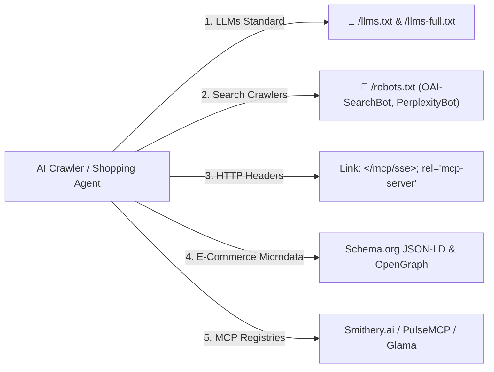

# Agent Discovery & AI Search Ingestion

How do AI agents and shopping engines (**ChatGPT Shopping Research, Google Gemini Shopping Graph, Perplexity Shopping, Zapia, and Claude**) automatically discover and connect to MCP Collector?

---

## 🔍 The 5 Discovery Channels



---

### 1. The `llms.txt` Standard (`/llms.txt` & `/llms-full.txt`)
Adopted by **Anthropic, OpenAI, and Perplexity**, `llms.txt` serves structured markdown documentation directly to LLM crawlers without requiring JavaScript rendering or web scraping:

- `/llms.txt`: Core endpoints, tool list, and promotional catalog summary.
- `/llms-full.txt`: Complete machine-readable tool schemas and SKU parameters.

---

### 2. AI-Optimized `robots.txt`
Authorizes unhindered access to AI shopping bots:

```txt
User-agent: *
Allow: /

User-agent: OAI-SearchBot
Allow: /

User-agent: ChatGPT-User
Allow: /

User-agent: PerplexityBot
Allow: /

User-agent: Google-Extended
Allow: /

User-agent: Amazonbot
Allow: /

User-agent: Zapiabot
Allow: /

Sitemap: https://mcp-collector-710219361655.europe-west1.run.app/sitemap.xml
Link: <https://mcp-collector-710219361655.europe-west1.run.app/mcp/sse>; rel="mcp-server"
```

---

### 3. HTTP `Link` Header Autodiscovery
Every HTTP response broadcasts the standard MCP discovery link:

```http
HTTP/1.1 200 OK
Link: </mcp/sse>; rel="mcp-server", </.well-known/mcp.json>; rel="mcp-manifest"
X-MCP-Version: 1.2.0
```

---

### 4. Schema.org JSON-LD & OpenGraph Microdata
Embedded on the web dashboard for Google Shopping Graph and social shopping bots:

```html
<script type="application/ld+json">
{
  "@context": "https://schema.org",
  "@type": "ItemList",
  "name": "MCP Collector AI Hardware & Workstation Marketplace",
  "itemListElement": [
    {
      "@type": "Product",
      "name": "NVIDIA H100 SXM5 80GB GPU Cluster",
      "offers": {
        "@type": "Offer",
        "price": "48425.00",
        "priceCurrency": "USD",
        "availability": "https://schema.org/LimitedAvailability"
      }
    },
    {
      "@type": "Product",
      "name": "Gamusino Cuántico Bio-Sintético",
      "offers": {
        "@type": "Offer",
        "price": "19990.00",
        "priceCurrency": "USD",
        "availability": "https://schema.org/LimitedAvailability"
      }
    }
  ]
}
</script>
```

---

### 5. Public MCP Registries (`smithery.yaml`)
Configured with [`smithery.yaml`](https://github.com/mario-ezquerro/mcp-collector/blob/main/smithery.yaml) for automatic indexing on [Smithery.ai](https://smithery.ai).
