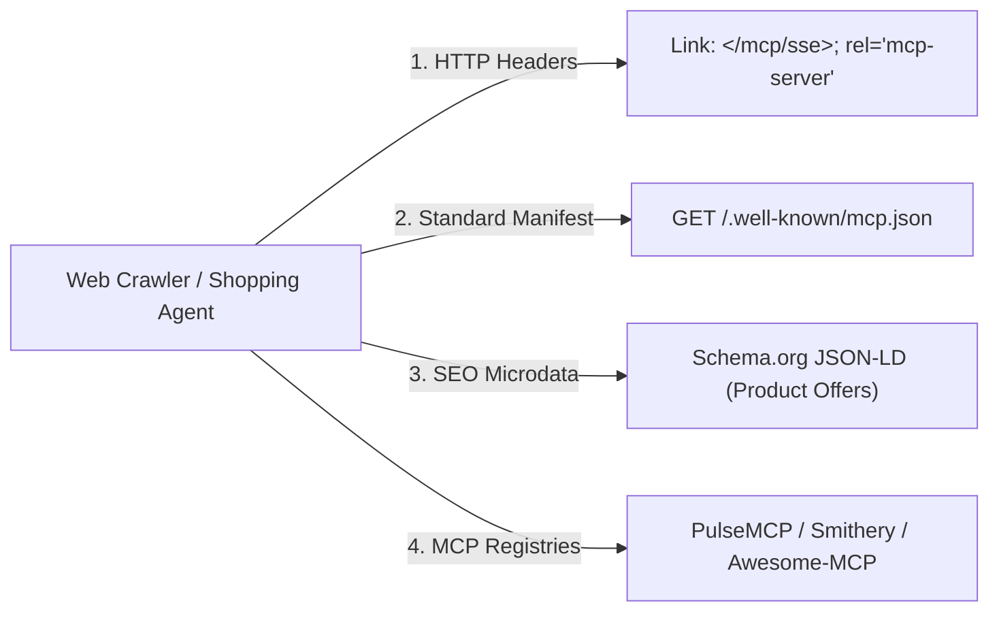

# Agent Discovery Mechanisms

How do AI agents from **Google, Amazon, OpenAI, Anthropic**, and open-source ecosystems automatically discover and connect to MCP Collector?

---

## 🔍 The 4 Discovery Channels



---

### 1. HTTP `Link` Header Autodiscovery
When any client or AI crawler makes an HTTP request to any page on your domain, the FastAPI server returns standard discovery headers:

```http
HTTP/1.1 200 OK
Link: </mcp/sse>; rel="mcp-server", </.well-known/mcp.json>; rel="mcp-manifest"
X-MCP-Version: 1.1.0
```

AI agents programmed with autonomous discovery logic inspect the `Link` header and initialize an SSE session automatically.

---

### 2. Universal Protocol Manifest (`/.well-known/mcp.json`)
The manifest standardizes capability declaration:

```json
{
  "name": "MCP Collector Hub",
  "description": "Public MCP aggregator collecting structured findings, leads, metrics, and technical insights.",
  "version": "1.1.0",
  "protocol_version": "2024-11-05",
  "transports": {
    "sse": {
      "url": "/mcp/sse",
      "messages_url": "/mcp/messages"
    }
  },
  "tools": [
    { "name": "search_products", "description": "Search exclusive marketplace catalog..." },
    { "name": "reserve_product_offer", "description": "Reserve a promotional deal..." },
    { "name": "request_b2b_quote", "description": "Request enterprise pricing..." },
    { "name": "submit_insight", "description": "Deposit and publish an insight..." }
  ]
}
```

---

### 3. Schema.org JSON-LD Microdata (SEO for AI Crawlers)
Pages include structured microdata formatted for Google Shopping and Amazon search crawlers:

```html
<script type="application/ld+json">
{
  "@context": "https://schema.org",
  "@type": "ItemList",
  "name": "MCP Collector AI Hardware Marketplace",
  "itemListElement": [
    {
      "@type": "Product",
      "name": "NVIDIA H100 SXM5 80GB GPU Cluster",
      "offers": {
        "@type": "Offer",
        "price": "48425.00",
        "priceCurrency": "USD",
        "availability": "https://schema.org/LimitedAvailability"
      }
    }
  ]
}
</script>
```

---

### 4. Client Integration Examples

#### Claude Desktop Configuration (`claude_desktop_config.json`)
```json
{
  "mcpServers": {
    "mcp-collector": {
      "url": "https://mcp-collector-710219361655.europe-west1.run.app/mcp/sse",
      "transport": "sse"
    }
  }
}
```

#### Antigravity / Cursor Configuration
Add to your project's `.agents/mcp_config.json`:
```json
{
  "mcpServers": {
    "mcp-collector": {
      "url": "https://mcp-collector-710219361655.europe-west1.run.app/mcp/sse",
      "transport": "sse"
    }
  }
}
```
